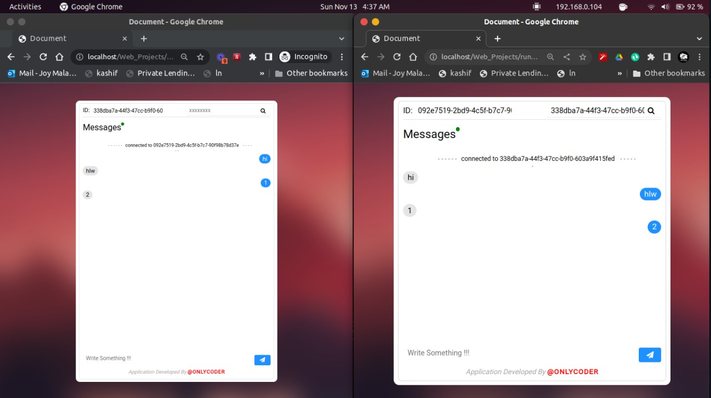

# Project Title

Simple Peerjs chatting application  .

## Description

A HTML5 based serverless chat application run without installing any software or any signup.



## Getting Started

### Dependencies

* Chrome / Firefox /Edge
* Cross Plartform

### Installing

* No install Needed

### Executing program

* Run The html file

## Help

Any advise for common problems or issues.
```
Don't Recive any error or something , for anykind of error press ctrl+shift+r to clear caches.
```

## Authors

Contributors names and contact info

ex. Arpon
ex. [[@a4arpon](https://github.com/a4arpon)]

ex. 0xAungkon
ex. [[@0xaungkon](https://github.com/0xaungkon)]

## License

This project is licensed under the Gnu License - see the LICENSE.md file for details

## Acknowledgments

Inspiration, code snippets, etc.
* [peer-js](https://github.com/peers/peerjs)
